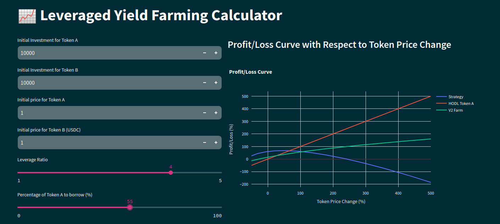

# Leveraged Yield Farming (LYF) Calculator

A Python-based calculator for simulating leveraged yield farming strategies. This tool helps users estimate potential returns and risks associated with leveraged positions in decentralized finance (DeFi) protocols.

# Leveraged Yield Farming Calculator

A Python-based calculator for simulating leveraged yield farming strategies. This tool helps users estimate potential returns and risks associated with leveraged positions in decentralized finance (DeFi) protocols.

---

## Table of Contents

- [Features](#features)
- [Usage](#usage)
- [License](#license)

---

## Features

- **Yield Farming Simulation**: Estimate returns from yield farming strategies.
- **Leverage Calculation**: Calculate outcomes with different leverage ratios.
- **Risk Analysis**: Assess risks associated with leveraged positions.
- **Interactive Interface**: Simple command-line interface for ease of use.

---

## Usage

You can access the app via [streamlit](https://lyfcalculator.streamlit.app/)

---

## License

Distributed under the MIT License. See LICENSE for more information.
